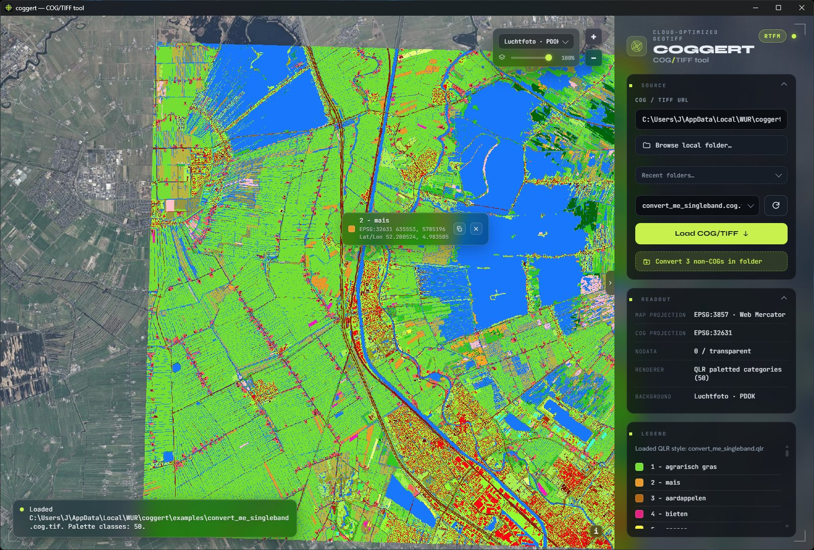

# COGGERT

A small **Windows desktop app** for **Cloud-Optimized GeoTIFFs (COG)** — view any GeoTIFF, and
convert plain rasters into fast, correct COGs. Per-user install, no admin.

*LGN land-use classification (QLR palette, 50 classes) over PDOK aerial, with the pixel inspector
reading a class in its native CRS + lat/lon.*

## Download & install

Grab the latest **`coggert_<version>_setup.exe`** from [**Releases**](../../releases/latest) and run it.

It's unsigned, so Windows SmartScreen shows *“Windows protected your PC”* → click
**More info → Run anyway**. Installs to `%LOCALAPPDATA%\WUR\coggert`; uninstall via *Add/Remove
Programs*. Needs the Edge **WebView2** runtime (present on Win10/11; the installer fetches it if
missing).

## What it does

- **View** any GeoTIFF over OSM / Esri / PDOK basemaps or fully offline — live pixel inspector
  (native CRS + lat/lon, copy-as-CSV), worldwide reprojection.
- **Convert** non-COGs → COGs with a bundled GDAL: **DEFLATE + NoData** (GeoServer-safe, the
  default — incl. RGB) or JPEG + mask; resampling **Auto · by file**.
- **Bulk convert** a whole folder (or a multi-file drop) — per-file resampling, skip-already-done,
  Cancel + an error summary.
- Remembers recent folders, an in-app **RTFM** manual, and **`coggert-cli`** for scripting.

## Source & issues

This repository hosts **downloads only**. The source code, issue tracker and development live on
**WUR GitLab** (internal): `git.wur.nl`.

## License

[MIT](LICENSE) © JF / Wageningen University & Research.
